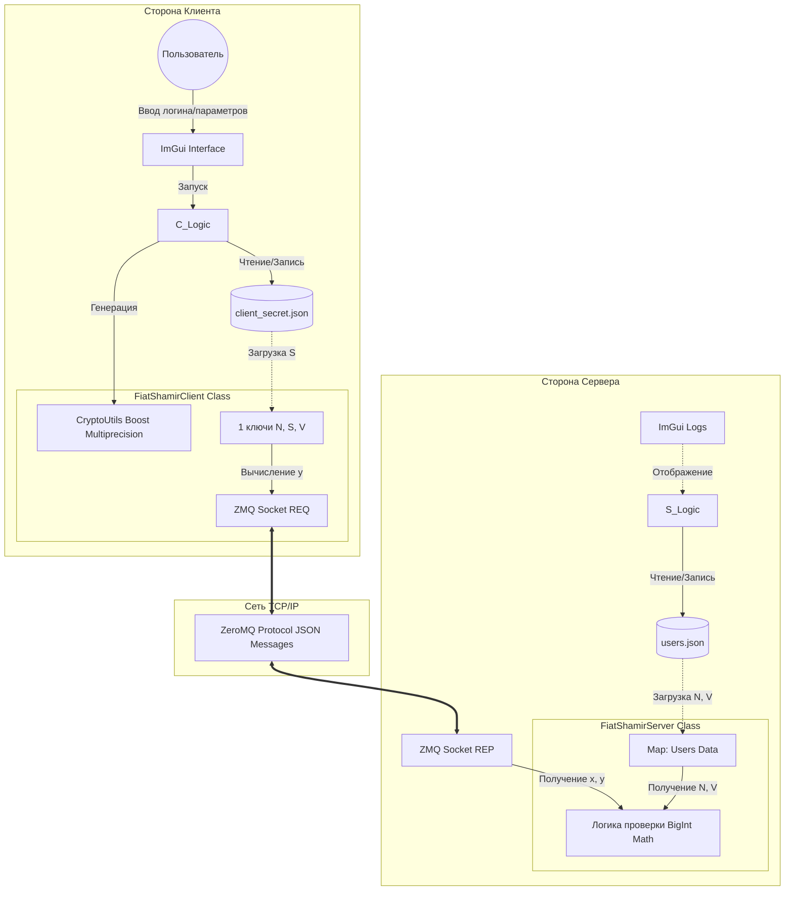
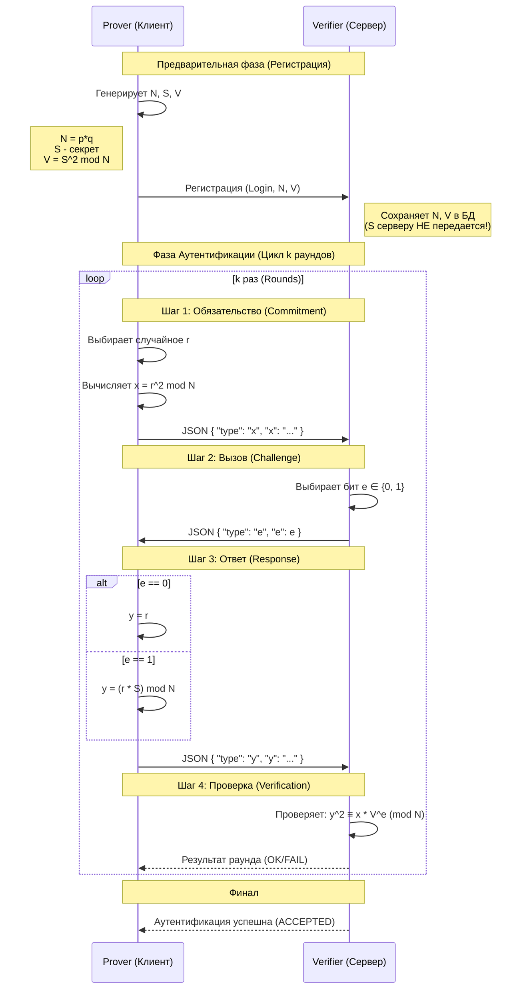

```mermaid
graph TD
    subgraph Client_Side [Сторона Клиента]
        C_User((Пользователь)) -->|Ввод логина/параметров| C_GUI[ImGui Interface]
        
        subgraph Client_Logic [FiatShamirClient Class]
            C_Crypto[CryptoUtils Boost Multiprecision]
            C_Keys[1 ключи  N, S, V]
            C_Socket[ZMQ Socket REQ]
        end
        
        C_GUI -->|Запуск| C_Logic
        C_Logic -->|Генерация| C_Crypto
        C_Logic -->|Чтение/Запись| C_File[(client_secret.json)]
        C_File -.->|Загрузка S| C_Keys
    end

    subgraph Network [Сеть TCP/IP]
        Link[ZeroMQ Protocol JSON Messages]
    end

    subgraph Server_Side [Сторона Сервера]
        S_Socket[ZMQ Socket REP]
        
        subgraph Server_Logic [FiatShamirServer Class]
            S_Auth[Логика проверки BigInt Math]
            S_DB_Mem[Map: Users Data]
        end
        
        S_GUI[ImGui Logs] -.->|Отображение| S_Logic
        S_Logic -->|Чтение/Запись| S_File[(users.json)]
        S_File -.->|Загрузка N, V| S_DB_Mem
    end

    C_Socket <==> Link <==> S_Socket
    
    %% Связи внутри логики
    C_Keys -->|Вычисление y| C_Socket
    S_Socket -->|Получение x, y| S_Auth
    S_DB_Mem -->|Получение N, V| S_Auth
```

```mermaid
sequenceDiagram
    participant P as Prover (Клиент)
    participant V as Verifier (Сервер)

    Note over P, V: Предварительная фаза (Регистрация)
    P->>P: Генерирует N, S, V
    Note left of P: N = p*q<br/>S - секрет<br/>V = S^2 mod N
    P->>V: Регистрация (Login, N, V)
    Note right of V: Сохраняет N, V в БД<br/>(S серверу НЕ передается!)

    Note over P, V: Фаза Аутентификации (Цикл k раундов)
    
    loop k раз (Rounds)
        Note over P, V: Шаг 1: Обязательство (Commitment)
        P->>P: Выбирает случайное r
        P->>P: Вычисляет x = r^2 mod N
        P->>V: JSON { "type": "x", "x": "..." }
        
        Note over P, V: Шаг 2: Вызов (Challenge)
        V->>V: Выбирает бит e ∈ {0, 1}
        V->>P: JSON { "type": "e", "e": e }
        
        Note over P, V: Шаг 3: Ответ (Response)
        alt e == 0
            P->>P: y = r
        else e == 1
            P->>P: y = (r * S) mod N
        end
        P->>V: JSON { "type": "y", "y": "..." }
        
        Note over P, V: Шаг 4: Проверка (Verification)
        V->>V: Проверяет: y^2 ≡ x * V^e (mod N)
        V-->>P: Результат раунда (OK/FAIL)
    end

    Note over P, V: Финал
    V-->>P: Аутентификация успешна (ACCEPTED)
```